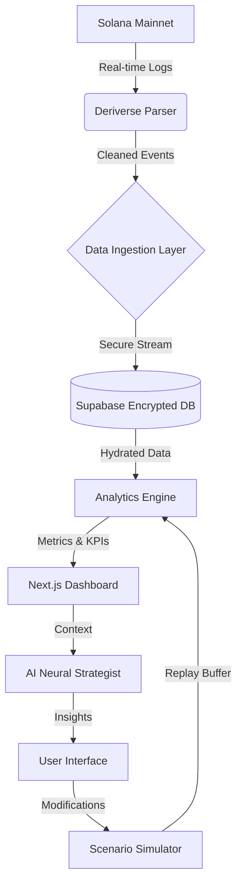

# ⚒️ PnlForge: The Ultimate On-Chain Trading Intelligence Suite

[](https://opensource.org/licenses/MIT)
[](#)
[](#)
[](#)
[](https://pnl-forge.vercel.app)

> **Forge your success through data.** PnlForge is the 2026-standard intelligence layer for traders who demand absolute transparency, auditable performance, and AI-driven insights. Built for the **Deriverse Hackathon**.

---

## 🚀 Quick Links

**🔗 [Try PnlForge Live](https://pnl-forge.vercel.app)** • **📚 [Full Docs](./pnl-forge-dashboard-design/README.md)** • **🎨 [Design System](./designsystem.md)** • **🚀 [Deploy Guide](./pnl-forge-dashboard-design/DEPLOYMENT.md)**

---

## 🌟 What is PnlForge?

In the volatile landscape of 2026 DeFi, performance is nothing without **auditability**. PnlForge bridges the gap between raw on-chain transaction logs and actionable trading intelligence.

**The Problem:** Traditional trading journals are disconnected from the blockchain. Manual entry is prone to error, and most analytics tools are either too simple or overly custodial.

**The Solution:** PnlForge connects directly to **Solana**, parsing **Deriverse** events in real-time to provide a deterministic, immutable record of performance—combined with an AI-powered strategist, scenario simulator, and professional journal.

---

## ✨ Key Features

### 💎 Professional Analytics
- **20+ Advanced Metrics** - Sharpe, Sortino, Calmar, K-Ratio, Kelly Criterion
- **Equity Curves with Drawdown Analysis** - Precision visualizations of your performance
- **Fee Decomposition** - Understand maker vs. taker impact
- **Time-Based Performance Heatmaps** - See when you trade best

### 📓 Quantified Trading Journal
- **Encrypted Global Notes** - Professional-grade encryption for your trade notes
- **Strategy Tagging** - Organize and analyze trades by strategy
- **Trade Review Cycle** - Built-in workflow for continuous improvement

### 🤖 AI-Powered Intelligence
- **Neural Strategist** - HuggingFace AI advisor analyzing your specific trading patterns
- **Natural Language Queries** - Ask about your equity curve, risk metrics, or performance
- **Scenario Simulator** - Test "what if" scenarios: different stop-losses, position sizes, etc.

### 🏆 Gamification & Community
- **8-Tier Achievement System** - Track consistency, discipline, and risk management
- **Privacy-Preserving Benchmarks** - Compare against anonymous global community
- **Percentile Radar** - See exactly where you rank

---

## 🛠️ Technology Stack

| Component | Technology |
|-----------|-----------|
| **Frontend** | Next.js 16 • React 19 • TypeScript • Tailwind CSS |
| **UI Components** | shadcn/ui • Radix UI • Recharts |
| **Database** | Supabase (PostgreSQL) • Row-Level Security |
| **Blockchain** | Solana web3.js • Wallet Adapter |
| **AI** | Vercel AI SDK • HuggingFace Inference |
| **Auth** | JWT • Message Signing • tweetnacl |
| **Deployment** | Vercel • GitHub Actions |

---

## 🏗️ Project Structure

```
PnLForge/
├── pnl-forge-dashboard-design/
│   ├── app/
│   │   ├── api/                   # API routes (auth, trades, AI)
│   │   ├── dashboard/             # Main dashboard (8 pages)
│   │   ├── ingestion/             # Wallet connection
│   │   └── layout.tsx
│   ├── components/                # React components
│   │   └── ui/                   # shadcn/ui components (30+)
│   ├── lib/                       # Core utilities
│   │   ├── auth.ts               # JWT & wallet authentication
│   │   ├── metrics.ts            # 20+ metric calculations
│   │   ├── supabase.ts           # Database client
│   │   ├── deriverse-parser.ts   # On-chain trade parsing
│   │   └── types.ts              # TypeScript types
│   ├── hooks/                     # Custom React hooks
│   ├── styles/                    # Global CSS
│   ├── .npmrc                     # npm config (React 19 legacy peer deps)
│   ├── DEPLOYMENT.md              # Step-by-step deployment guide
│   └── package.json
├── PRD.md                         # Product requirements document
├── designsystem.md                # Design tokens & UI patterns
└── README.md                      # Documentation
```

---

## 🚀 Getting Started

### View Live
Simply visit **[https://pnl-forge.vercel.app](https://pnl-forge.vercel.app)**

### Local Development
```bash
cd pnl-forge-dashboard-design
npm install
npm run dev
```
Then open `http://localhost:3000`

### Deploy to Vercel (Recommended)
See [DEPLOYMENT.md](./pnl-forge-dashboard-design/DEPLOYMENT.md) for detailed step-by-step instructions.

Quick version:
1. Push to GitHub
2. Go to [vercel.com](https://vercel.com)
3. Import repository
4. Add environment variables
5. Deploy ✅

---

## 🔐 Security & Privacy

PnlForge is **Non-Custodial Intelligence**:

- ✅ **No Private Keys** - Never stored, transmitted, or accessed
- ✅ **Wallet Signing** - Prove identity without risking funds (Message Signing)
- ✅ **At-Rest Encryption** - Sensitive notes encrypted with AES-256-GCM
- ✅ **Row-Level Security** - Database policies enforce user isolation
- ✅ **Audit Logs** - Every change tracked for transparency
- ✅ **No Custodial Access** - Read-only blockchain access only

---

## 📊 Dashboard Pages

| Page | Features |
|------|----------|
| **Overview** | KPI cards, equity curve, AI advisory, performance metrics |
| **Analytics** | Daily P&L, win rate, trade statistics, advanced metrics |
| **Trade History** | Full trade ledger, search, filtering, export |
| **Journal** | Trade annotations, strategy tagging, notes |
| **Simulator** | Test scenarios: position size, stop-loss, worst trade exclusion |
| **Achievements** | 8-tier mastery system with milestones |
| **Benchmarks** | Community percentiles, privacy-preserved rankings |
| **Settings** | Theme, preferences, data management |

---

## 🎯 Hackathon Submission

**Built for:** Deriverse Hackathon 2026  
**Live Demo:** [https://pnl-forge.vercel.app](https://pnl-forge.vercel.app)  
**Repository:** [https://github.com/adamstosho/PnLForge](https://github.com/adamstosho/PnLForge)

---

## 📝 Full Documentation

For detailed documentation:
- **[Main README](./pnl-forge-dashboard-design/README.md)** - Full feature breakdown & API reference
- **[PRD](./PRD.md)** - Product requirements & specifications  
- **[Design System](./designsystem.md)** - UI tokens, colors, components, patterns
- **[Deployment Guide](./pnl-forge-dashboard-design/DEPLOYMENT.md)** - Deploy to Vercel, Docker, VPS, or custom domain

---

## 🤝 Contributing

Contributions welcome! Please:

1. Fork the repository
2. Create a feature branch (`git checkout -b feature/AmazingFeature`)
3. Commit changes (`git commit -m 'Add AmazingFeature'`)
4. Push to branch (`git push origin feature/AmazingFeature`)
5. Open a Pull Request

---

## 📄 License

Distributed under the **MIT License**. See [LICENSE](./LICENSE) for details.

---

<p align="center">
  <strong>Ready to forge your trading success?</strong>
  <br/><br/>
  <a href="https://pnl-forge.vercel.app"><strong>🚀 Launch PnlForge</strong></a> • 
  <a href="./pnl-forge-dashboard-design/README.md"><strong>📚 Read Docs</strong></a> • 
  <a href="./pnl-forge-dashboard-design/DEPLOYMENT.md"><strong>🌍 Deploy</strong></a>
  <br/><br/>
  Built with ❤️ for the Deriverse Community<br/>
  © 2026 PnlForge. All rights reserved.
</p>

### 💎 Core Analytics
- **Deterministic Equity Curves**: Precision plotting of your growth with peak-to-trough drawdown overlays.
- **Advanced Risk Metrics**: Sharpe, Sortino, Calmar, K-Ratio, and Kelly Criterion calculated with 2026 industry-standard precision.
- **Entropy Analysis**: Time-based heatmaps showing your performance by hour, day, and session.
- **Fee Decomposition**: Granular breakdown of maker vs. taker fees and their impact on your net ROI.

### 📓 Quantum Trading Journal
- **Encrypted Global Notes**: Professional-grade encryption for your qualitative insights.
- **Strategy Tagging**: Associate trades with specific strategies (e.g., "Mean Reversion", "Breakout") and see aggregated performance per tag.
- **Review Cycle**: A built-in workflow to ensure every trade is analyzed, marked, and learned from.

### 🌍 Community & Benchmarks
- **Privacy-Preserving Benchmarks**: Compare your performance against the global PnlForge community using anonymized percentile rankings.
- **Percentile Radar**: See exactly where you rank in Win Rate, Sharpe, and Profit Factor without compromising your wallet's anonymity.

---

## 🏗️ Architecture & Data Flow

PnlForge follows a high-performance "Ingest-Process-Analyze" pipeline.



### 📡 Data Flow Description
1. **Ingestion**: Raw transaction signatures are pulled from the Solana RPC.
2. **Parsing**: The Deriverse SDK extracts specific trade events (fills, cancels, funding).
3. **Persistence**: Data is stored in a Supabase PostgreSQL instance with Row-Level Security (RLS).
4. **Intelligence**: The AI assistant reads the decrypted context to provide natural language advice.

---

## 💻 Tech Stack (2026 Editions)

| Layer | Technology | Purpose |
| :--- | :--- | :--- |
| **Frontend** | **Next.js 16 (React 19)** | Server-side rendering, App Router, and high-performance UI. |
| **Styling** | **Tailwind CSS 3 + Radix UI** | Fluid, accessible, and theme-aware design system. |
| **Database** | **Supabase (PostgreSQL)** | Secure, scalable storage with real-time capabilities. |
| **Blockchain** | **Solana web3.js** | Seamless interaction with the Solana network. |
| **AI Layer** | **Vercel AI SDK + OpenAI** | Streaming LLM integration for the Neural Strategist. |
| **Visualization**| **Recharts** | Precision-grade SVG charting and data viz. |
| **Security** | **JWT + tweetnacl** | Cryptographic wallet verification and session mgmt. |

---

## ⚙️ Installation & Setup

### Prerequisites
- **Node.js** v20.x or higher
- **npm** or **pnpm**
- A **Supabase** instance (URL & Anon Key)
- **OpenAI API Key** (for AI features)

### 1. Repository Setup
```bash
git clone https://github.com/your-org/pnl-forge-dashboard-design.git
cd pnl-forge-dashboard-design
npm install
```

### 2. Environment Configuration
Create a `.env.local` file:
```env
NEXT_PUBLIC_SUPABASE_URL=your-project-url
NEXT_PUBLIC_SUPABASE_ANON_KEY=your-anon-key
OPENAI_API_KEY=your-openai-api-key
JWT_SECRET=your-secure-random-string
NEXT_PUBLIC_RPC_ENDPOINT=https://api.mainnet-beta.solana.com
```

### 3. Database Schema
Initialize your database by running the migration script found in `lib/database.schema.sql` inside your Supabase SQL editor.

### 4. Launching the Forge
```bash
npm run dev
```
Navigate to `http://localhost:3000` to start your journey.

---

## 🔑 API Reference (v1.0)

All requests require a `Bearer` JWT token obtained via the `/auth/verify` flow.

| Endpoint | Method | Description |
| :--- | :--- | :--- |
| `/api/auth/challenge` | `POST` | Generates a 2026-standard nonce for signing. |
| `/api/auth/verify` | `POST` | Verifies signature and returns a session JWT. |
| `/api/trades/sync` | `POST` | Triggers a fresh on-chain reconciliation. |
| `/api/trades/summary` | `GET` | Returns high-level KPIs and equity series. |
| `/api/ai/chat` | `POST` | Streams insights from the Neural Strategist. |

---

## 🛡️ Security & Privacy Architecture

PnlForge is built on the principle of **Non-Custodial Intelligence**.

- **No Private Keys**: We never ask for, store, or transmit your private keys.
- **Message Signing**: Authentication is handled via `signMessage`, proving identity without risking funds.
- **At-Rest Encryption**: Sensitive journal notes are encrypted before hitting the database.
- **Audit Logs**: Every change to an annotation is logged for full auditable transparency.

---

## 🗺️ Roadmap (2026 and Beyond)

- [x] **Q1 2026**: Core Analytics & AI Integration (Current)
- [/] **Q2 2026**: Multi-Wallet Aggregation & Advanced Backtesting
- [ ] **Q3 2026**: Mobile Native Apps (iOS/Android) & Voice-Driven Journaling
- [ ] **Q4 2026**: Pro-Mode: High-Frequency Scalping Performance Layer

---

## 🤝 Contributing

We welcome the 1%ers of the engineering world to contribute.
1. Fork the repo.
2. Create your feature branch (`git checkout -b feature/AmazingFeature`).
3. Commit your changes (`git commit -m 'Add some AmazingFeature'`).
4. Push to the branch (`git push origin feature/AmazingFeature`).
5. Open a Pull Request.

---

## 📄 License

Distributed under the **MIT License**. See `LICENSE` for more information.

---

<p align="center">
  Built with ❤️ for the Deriverse Community by the PnlForge Team.
  <br/>
  © 2026 PnlForge. All rights reserved.
</p>
