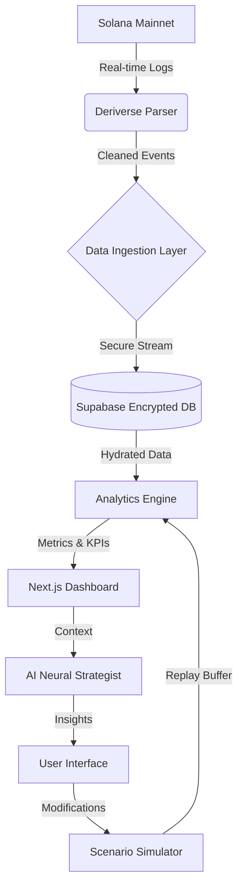

# ⚒️ PnlForge: The Ultimate On-Chain Trading Intelligence Suite

[](https://opensource.org/licenses/MIT)
[](#)
[](#)
[](#)

> **Forge your success through data.** PnlForge is not just a dashboard; it's a 2026-standard intelligence layer for traders who demand absolute transparency, auditable performance, and AI-driven insights.

---

## 🌟 Executive Summary

In the volatile landscape of 2026 DeFi, performance is nothing without auditability. **PnlForge** bridges the gap between raw on-chain transaction logs and actionable trading intelligence. It empowers traders to transition from "guessing" to "knowing" by providing a non-custodial, enterprise-grade analytics suite that turns every trade into a lesson.

### 🚩 The Problem
Traditional trading journals are disconnected from the source of truth—the blockchain. Manual entry is prone to error, "gut feeling" journaling lacks quantitative backing, and most analytics tools are either too simple or overly custodial.

### 🛡️ The PnlForge Solution
PnlForge connects directly to the **Solana** blockchain, parsing **Deriverse** events in real-time to provide a deterministic, immutable record of performance. We combine high-fidelity data with a professional journal, an AI-powered strategist, and a scenario simulator to create a virtuous cycle of improvement.

---

## 🚀 Vision & Sustainability

PnlForge is built for the long haul. Our vision is to standardize "Auditable Performance" as the benchmark for professional traders. By leveraging a modular architecture and open-source foundations (MIT), we ensure that the tool evolves alongside the DeFi ecosystem.

| Pillar | Description | 2026 Impact |
| :--- | :--- | :--- |
| **Auditability** | Every metric is traceable to a transaction signature. | High-trust environments. |
| **Intelligence** | AI doesn't just show data; it explains the "Why". | Accelerated learning curve. |
| **Growth** | Gamification turns the grind of journaling into a journey. | Sustainable trading habits. |
| **Privacy** | Non-custodial and encryption-first. | Your data, your control. |

---

## 🛠️ Key Innovations

### 🤖 AI-Powered Neural Strategist
Our integrated AI assistant (powered by OpenAI's latest 2026 models) doesn't just answer questions—it analyzes your specific equity curve, fee structures, and duration patterns to suggest concrete strategy adjustments.

### 🧪 Paradox Scenario Simulator
What if you had used a 1.5x multiplier? What if you had a strict 2% stop-loss? Our simulator replays your actual historical trades under new parameters to reveal the "what if" of your trading career.

### 🏆 Gamified Mastery System
Trading is a mental game. Our 8-tier achievement system tracks not just PnL, but consistency, discipline (journaling), and risk management excellence.

---

## 📊 Comprehensive Feature Breakdown

### 💎 Core Analytics
- **Deterministic Equity Curves**: Precision plotting of your growth with peak-to-trough drawdown overlays.
- **Advanced Risk Metrics**: Sharpe, Sortino, Calmar, K-Ratio, and Kelly Criterion calculated with 2026 industry-standard precision.
- **Entropy Analysis**: Time-based heatmaps showing your performance by hour, day, and session.
- **Fee Decomposition**: Granular breakdown of maker vs. taker fees and their impact on your net ROI.

### 📓 Quantum Trading Journal
- **Encrypted Global Notes**: Professional-grade encryption for your qualitative insights.
- **Strategy Tagging**: Associate trades with specific strategies (e.g., "Mean Reversion", "Breakout") and see aggregated performance per tag.
- **Review Cycle**: A built-in workflow to ensure every trade is analyzed, marked, and learned from.

### 🌍 Community & Benchmarks
- **Privacy-Preserving Benchmarks**: Compare your performance against the global PnlForge community using anonymized percentile rankings.
- **Percentile Radar**: See exactly where you rank in Win Rate, Sharpe, and Profit Factor without compromising your wallet's anonymity.

---

## 🏗️ Architecture & Data Flow

PnlForge follows a high-performance "Ingest-Process-Analyze" pipeline.



### 📡 Data Flow Description
1. **Ingestion**: Raw transaction signatures are pulled from the Solana RPC.
2. **Parsing**: The Deriverse SDK extracts specific trade events (fills, cancels, funding).
3. **Persistence**: Data is stored in a Supabase PostgreSQL instance with Row-Level Security (RLS).
4. **Intelligence**: The AI assistant reads the decrypted context to provide natural language advice.

---

## 💻 Tech Stack (2026 Editions)

| Layer | Technology | Purpose |
| :--- | :--- | :--- |
| **Frontend** | **Next.js 16 (React 19)** | Server-side rendering, App Router, and high-performance UI. |
| **Styling** | **Tailwind CSS 3 + Radix UI** | Fluid, accessible, and theme-aware design system. |
| **Database** | **Supabase (PostgreSQL)** | Secure, scalable storage with real-time capabilities. |
| **Blockchain** | **Solana web3.js** | Seamless interaction with the Solana network. |
| **AI Layer** | **Vercel AI SDK + OpenAI** | Streaming LLM integration for the Neural Strategist. |
| **Visualization**| **Recharts** | Precision-grade SVG charting and data viz. |
| **Security** | **JWT + tweetnacl** | Cryptographic wallet verification and session mgmt. |

---

## ⚙️ Installation & Setup

### Prerequisites
- **Node.js** v20.x or higher
- **npm** or **pnpm**
- A **Supabase** instance (URL & Anon Key)
- **OpenAI API Key** (for AI features)

### 1. Repository Setup
```bash
git clone https://github.com/your-org/pnl-forge-dashboard-design.git
cd pnl-forge-dashboard-design
npm install
```

### 2. Environment Configuration
Create a `.env.local` file:
```env
NEXT_PUBLIC_SUPABASE_URL=your-project-url
NEXT_PUBLIC_SUPABASE_ANON_KEY=your-anon-key
OPENAI_API_KEY=your-openai-api-key
JWT_SECRET=your-secure-random-string
NEXT_PUBLIC_RPC_ENDPOINT=https://api.mainnet-beta.solana.com
```

### 3. Database Schema
Initialize your database by running the migration script found in `lib/database.schema.sql` inside your Supabase SQL editor.

### 4. Launching the Forge
```bash
npm run dev
```
Navigate to `http://localhost:3000` to start your journey.

---

## 🔑 API Reference (v1.0)

All requests require a `Bearer` JWT token obtained via the `/auth/verify` flow.

| Endpoint | Method | Description |
| :--- | :--- | :--- |
| `/api/auth/challenge` | `POST` | Generates a 2026-standard nonce for signing. |
| `/api/auth/verify` | `POST` | Verifies signature and returns a session JWT. |
| `/api/trades/sync` | `POST` | Triggers a fresh on-chain reconciliation. |
| `/api/trades/summary` | `GET` | Returns high-level KPIs and equity series. |
| `/api/ai/chat` | `POST` | Streams insights from the Neural Strategist. |

---

## 🛡️ Security & Privacy Architecture

PnlForge is built on the principle of **Non-Custodial Intelligence**.

- **No Private Keys**: We never ask for, store, or transmit your private keys.
- **Message Signing**: Authentication is handled via `signMessage`, proving identity without risking funds.
- **At-Rest Encryption**: Sensitive journal notes are encrypted before hitting the database.
- **Audit Logs**: Every change to an annotation is logged for full auditable transparency.

---

## 🗺️ Roadmap (2026 and Beyond)

- [x] **Q1 2026**: Core Analytics & AI Integration (Current)
- [/] **Q2 2026**: Multi-Wallet Aggregation & Advanced Backtesting
- [ ] **Q3 2026**: Mobile Native Apps (iOS/Android) & Voice-Driven Journaling
- [ ] **Q4 2026**: Pro-Mode: High-Frequency Scalping Performance Layer

---

## 🤝 Contributing

We welcome the 1%ers of the engineering world to contribute.
1. Fork the repo.
2. Create your feature branch (`git checkout -b feature/AmazingFeature`).
3. Commit your changes (`git commit -m 'Add some AmazingFeature'`).
4. Push to the branch (`git push origin feature/AmazingFeature`).
5. Open a Pull Request.

---

## 📄 License

Distributed under the **MIT License**. See `LICENSE` for more information.

---

<p align="center">
  Built with ❤️ for the Deriverse Community by the PnlForge Team.
  <br/>
  © 2026 PnlForge. All rights reserved.
</p>
